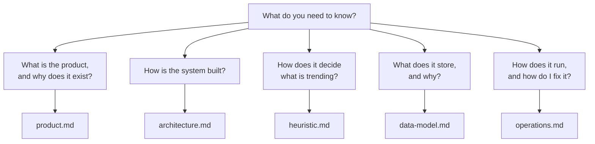

# Trendjack documentation

## What this is

This folder holds the documentation for Trendjack. Each document answers one question.

## Why we need it

The repository shows what the code does. It does not show why the code does it. A reader who
starts here must understand the product, the heuristic and the deployed system in one hour.

## How it is achieved

One document per question. Start at the top and stop when you have your answer.

- [product.md](product.md). What Trendjack is, why detection is the hard part, and the rules the
  platforms force on us.
- [architecture.md](architecture.md). The parts, the ports, and the path a video takes from
  TikTok to the page.
- [heuristic.md](heuristic.md). The current scoring rules, as the code runs them today.
- [data-model.md](data-model.md). The append only history, and the keys that make every read a
  query.
- [operations.md](operations.md). The daily run, the deploy, the gates, and the known gaps.

Two documents live next to the code they describe. Read them after these.

- [../apps/web/DESIGN.md](../apps/web/DESIGN.md). The rules for the page a person reads.
- [../infra/README.md](../infra/README.md). How to apply the infrastructure.

## Status of this documentation

Written on 2026-08-13, against the code on `main` at that date. Every number in these documents
comes from the source. Where the code and an earlier plan disagree, these documents describe the
code, and they name the difference.
