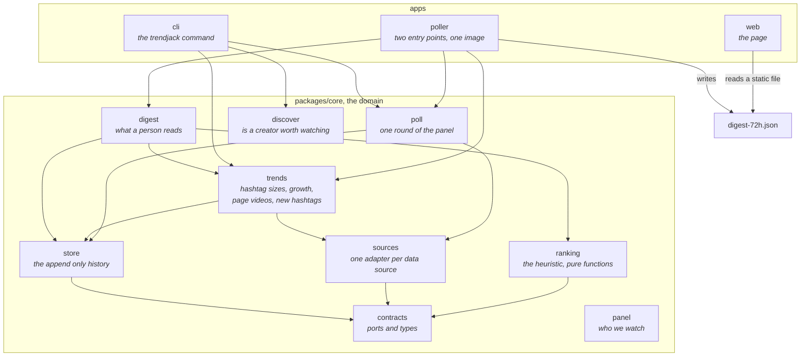
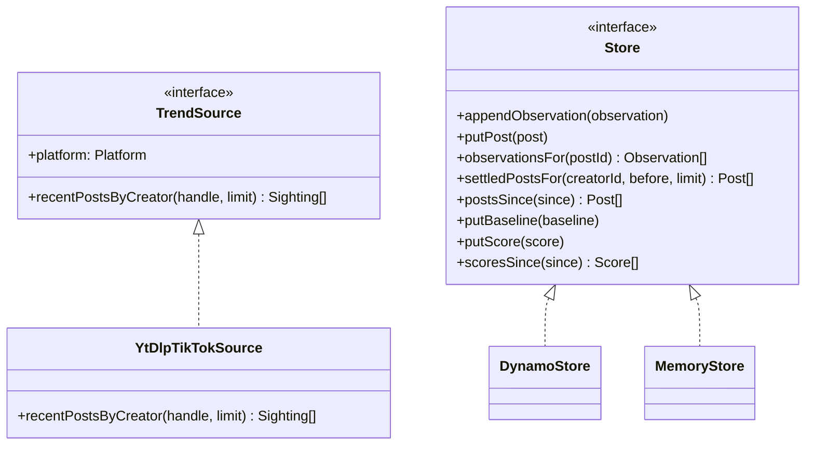
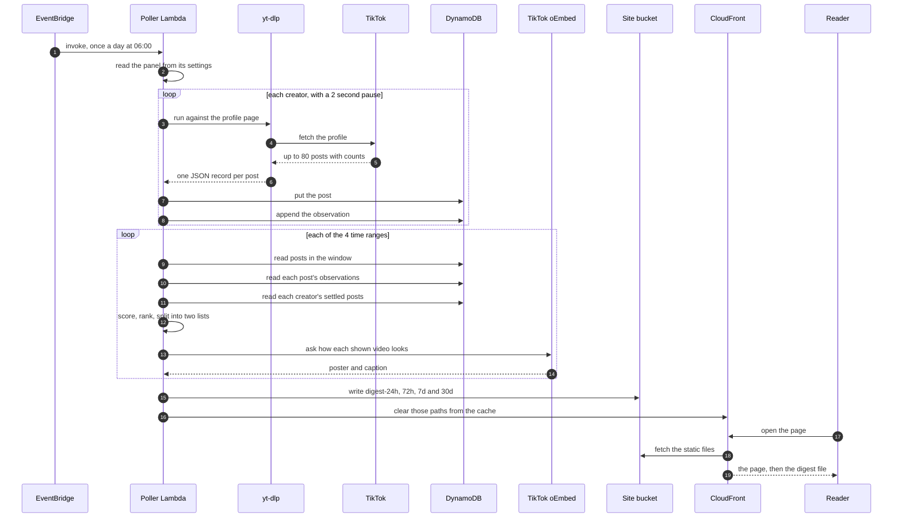
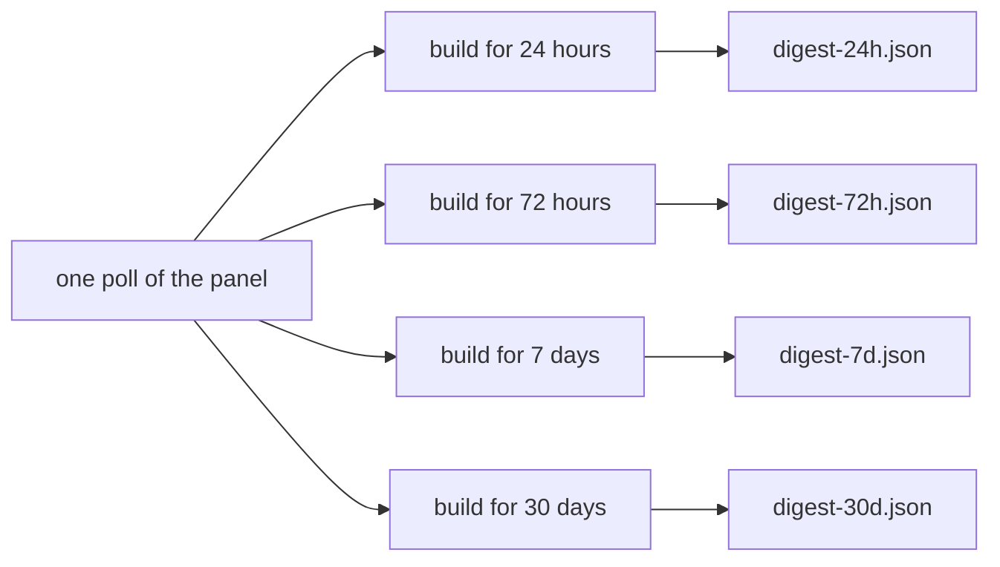
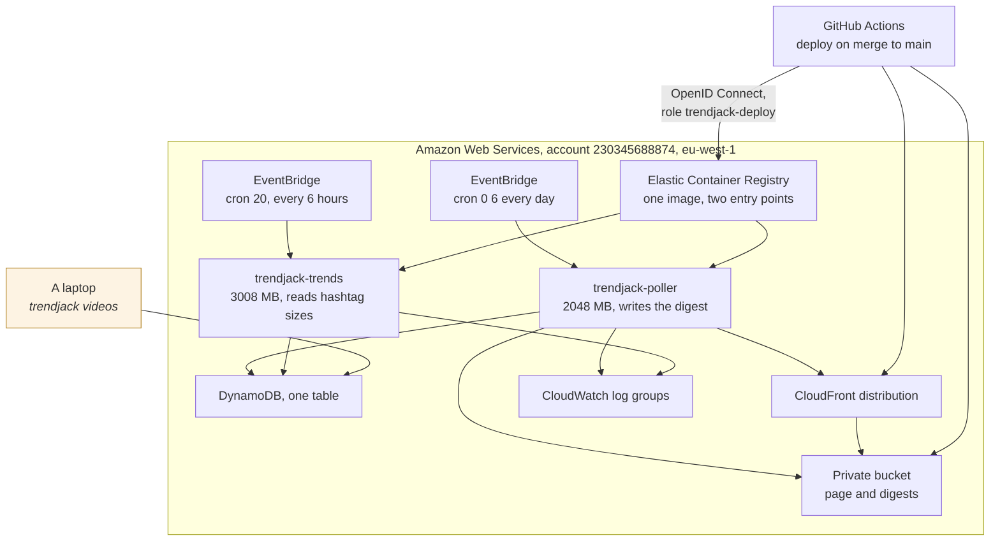

# Architecture

## What the system is

Trendjack is one monorepo on npm workspaces. It holds a domain package and three applications.
There is no build step. Node strips the types and runs the source directly, in a terminal and
inside the container alike.

## Why it is shaped this way

The domain must not know where its data came from, or where its output goes. Vendors in this
market appear and disappear. A tool that works today reports broken next month. So every outside
system sits behind a port, and nothing above the port learns which tool answered.

## How it is achieved

One package holds the domain. Each application wires the domain to real adapters.

## The ports

A port is an interface the domain owns. An adapter implements it. There are two ports.

**`TrendSource`.** Somewhere posts can be fetched from. The port deliberately cannot ask what is
trending, because no such question can be answered by naming a creator. It can only fetch what a
named creator posted.

**`TagStatsSource` and `TagVideoSource`.** The two questions a hashtag will answer: how big it is,
and which videos it is showing. These need a browser rather than a request, and for opposite
reasons. See [topics.md](topics.md).

Today one adapter exists. `YtDlpTikTokSource` runs yt-dlp with `--flat-playlist --dump-json`
against a creator's profile page. That command returns view, like, comment and repost counts and
the posted time, in one request per creator.

Instagram has no adapter yet. The port is ready for one.

**`Store`.** The append only history. An observation is never updated in place. See
[data-model.md](data-model.md).

## The path a video takes

## Why the page has no API

The page is static React in the same bucket as the digest files. It reads the digest from its own
address. There is no server, no gateway and no authorizer to run.

The data changes once a day. A cache that lasts a day is correct. An API would add cost, failure
modes and latency, and would answer the same question with the same file.

## Why one digest file per time range

A reader can choose how far back to look. There are four ranges: 24 hours, 3 days, 7 days and
30 days. The default is 3 days.

Each range is built and published as its own file. The page does not filter one wide file.

The reason is that the window is not only a filter. Two of the features are counted inside the
window. How many other watched creators are on the same shape depends on the window. How crowded
a sound is depends on the window. Filtering a 30 day file down to one day would keep numbers that
answer a different question.

## The deployed footprint

One table, one bucket, one distribution, one registry, two functions from one image.

The laptop is the part that should not be there. Ranking the videos on a hashtag page needs the
page to draw itself, and a rendered page from that image comes back as a captcha, so that one job
still runs from a desktop browser. See [operations.md](operations.md).

## The command line application

`apps/cli` runs the same domain code from a terminal. It exists for four jobs.

- `trendjack tags <hashtag...>` records how big each hashtag is and says what changed.
- `trendjack videos <hashtag>` ranks the videos on one page and stores the result.

- `trendjack run` polls the creator panel once by hand, to see what it returns today.
- `trendjack qualify` checks a creator before we add them to the panel. It rejects a creator with
  too few posts, with no view counts, with a flat history, with a ceiling below the like floor,
  or with no post in the last 30 days. Each rejection carries the reason.

## The rules the code holds itself to

- Unknown is never zero. A count the tool did not report is left out of the observation. A
  deleted post produces no observation at all.
- An empty answer fails loudly. A source that returns nothing raises `EmptySourceResultError`,
  because a quiet creator and a broken tool look the same otherwise.
- One creator failing does not abandon the round. Every failure is carried back in the report. A
  round where every creator failed raises `PollFailedError`.
- The publish happens after the poll, never instead of it. If the poll fails, yesterday's file
  stays in place. A file of nothing would look like a quiet day.
- Identifiers are tagged types. A creator id cannot be passed where a post id belongs. The tag
  exists only in the type system and costs nothing at run time.
