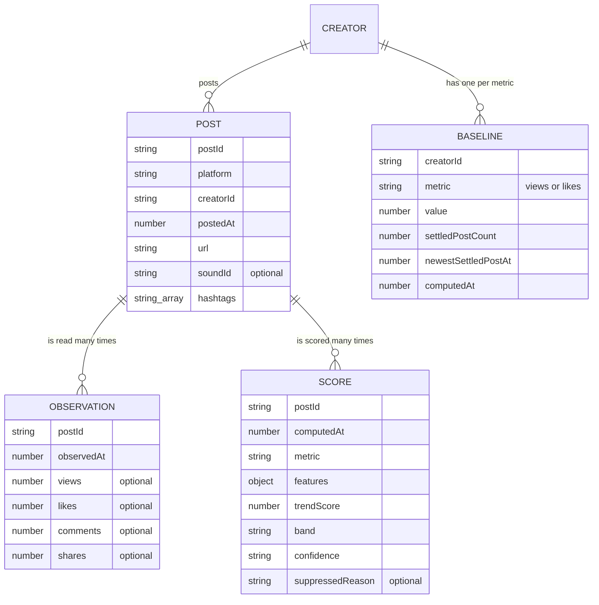
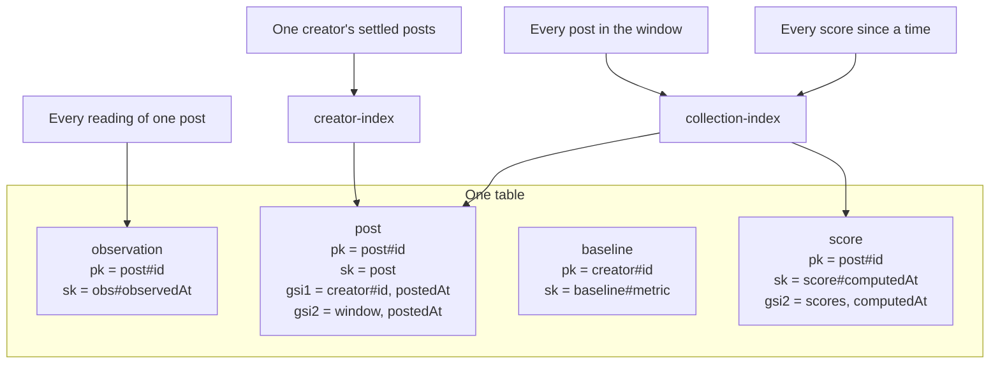
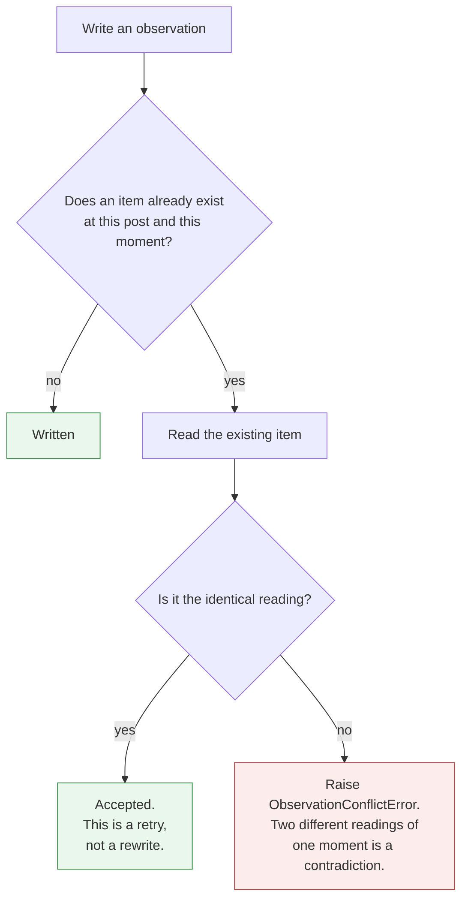
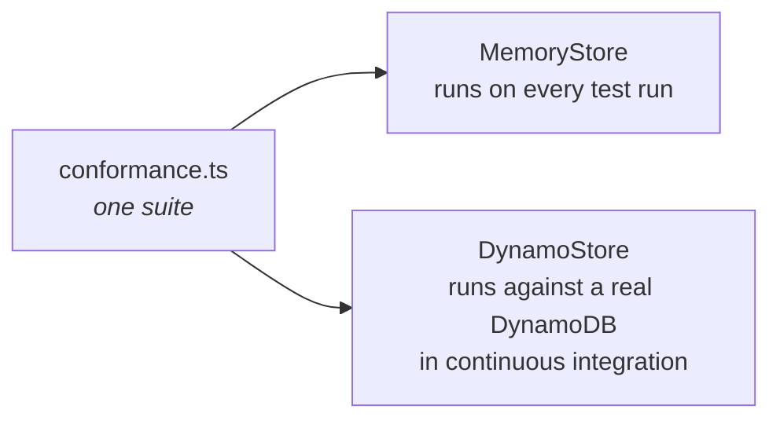
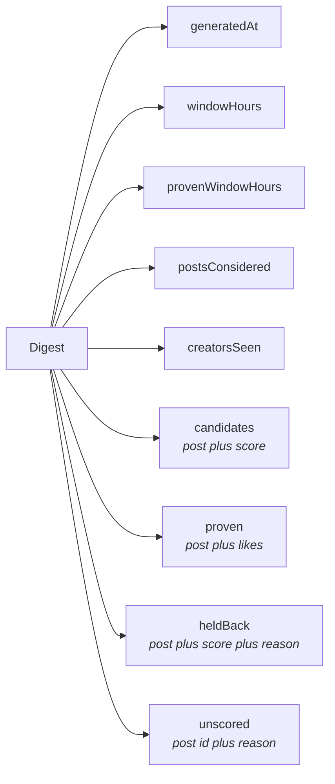

# The data model

## What it is

One DynamoDB table holds four kinds of item: a post, an observation, a baseline and a score.
Every value that enters the table is validated against a schema first.

## Why we need it this way

The history is the asset. The heuristic only becomes better than a guess if a proposed change can
be replayed over the whole past. A replay over an edited past proves nothing.

So the store is append only. An observation is never updated in place, and never overwritten with
a different value.

## How it is achieved

### The four kinds of item



### Why every count is optional

A field that is absent means unknown. A field set to zero means nobody watched. Those are opposite
facts and the model must not let them look alike.

A post that disappears produces no observation at all. It does not produce an observation full of
zeroes.

### Why a score carries its whole feature vector

A stored score must be replayable later. The final number alone cannot be re examined. The seven
features that produced it can.

### The topic items

Two more kinds share the table, both keyed by hashtag.

```
tag reading   pk = tag#<hashtag>   sk = reading#<observedAt>   gsi2 = tags, observedAt
tag videos    pk = tag#<hashtag>   sk = videos#<observedAt>
```

A reading is two exact counts. A videos item is the best videos on that page when it was last read,
plus every hashtag written in the captions on it. See [topics.md](topics.md).

The readings carry an index entry so that "every hashtag anybody has read" can be answered without
a list of hashtags being configured twice.

### The keys



Every read the pipeline makes is a query. None of them is a scan.

The two collection indexes exist because two of the questions have no natural key. "Every post in
the window" and "every score since" cannot be answered from a post id or a creator id.

### Why timestamps are padded

Sort keys are strings. Without padding, the string "9" sorts after the string "10". Every instant
in a sort key is padded to 16 characters.

### Why a query follows its pages

DynamoDB returns a page at a time. A partial answer read as a complete one is how history quietly
goes missing. `queryAll` follows every page before it returns.

## How a write is protected

An observation is written with a condition, so an existing reading cannot be replaced.



A retried poll writing the identical reading is allowed through. A different reading of the same
moment is raised, because one of the two is wrong and we must find out which.

## Two stores, one suite

There is an in memory store and a DynamoDB store. Both implement the same port.



### Why one suite runs against both

A fake whose behaviour is looser than the real thing manufactures a false pass. The fake accepts
what the real system rejects, the suite goes green, and production fails.

Holding both to one suite removes that gap. The integration file refuses to run without an
endpoint. It does not skip, because a skipped test and a passing test look the same in a summary.

## What the reader receives

The digest file the page reads is not the table. It is a rendered view, published per time range.



The last two lists are on the page for one reason. A day with three candidates and forty held back
videos is a different day from a quiet one, and the two must never look the same.

Each shown video also carries a poster image and a caption. Those come from TikTok's oEmbed
endpoint at publish time. That endpoint needs no key. A lookup that fails is not an error. The card
still works and simply has no poster.
