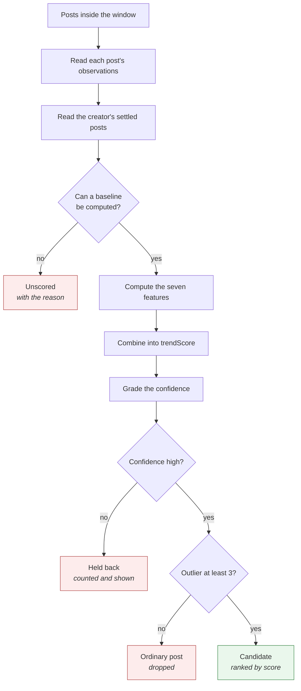
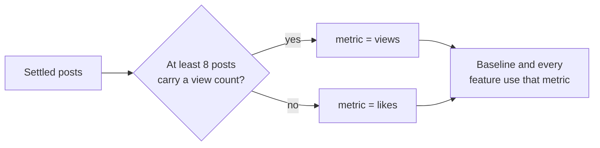
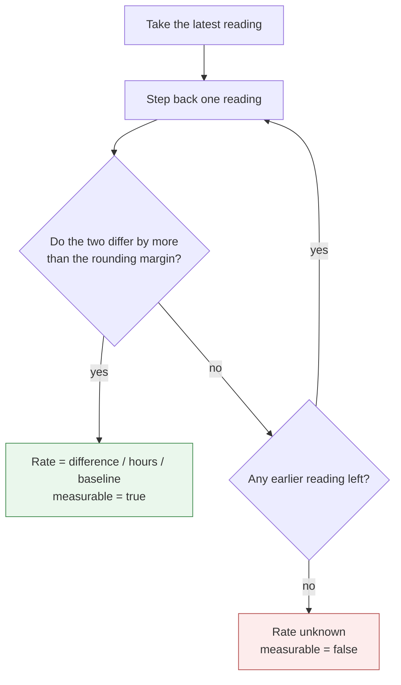
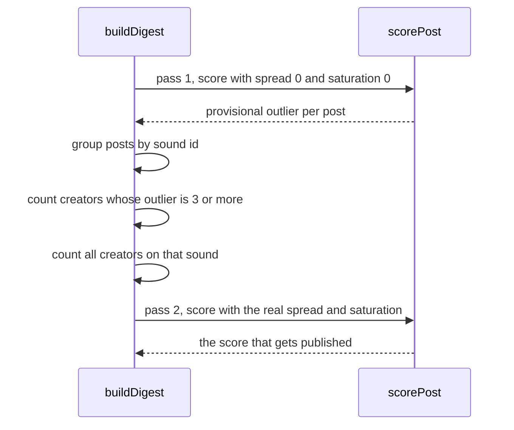
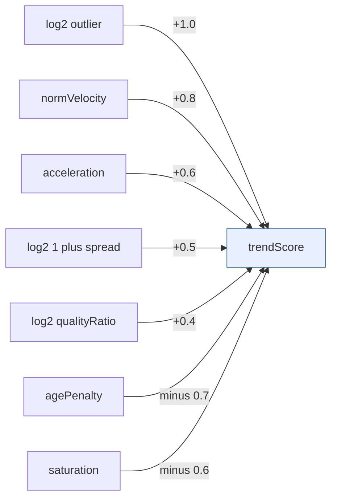
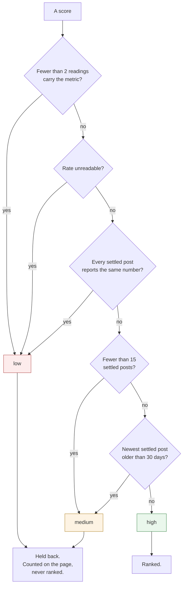
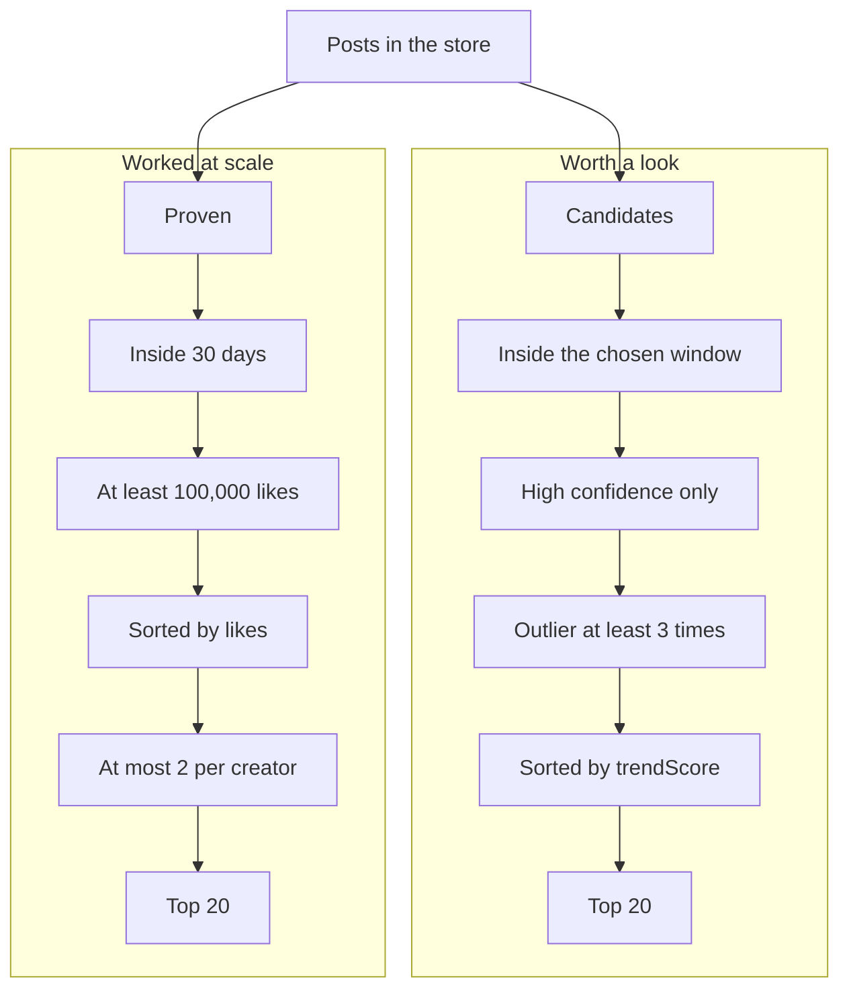
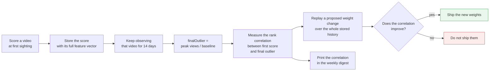

# The heuristic

## What the heuristic is

The heuristic answers one question. Given everything we have observed, which video posted inside
the window is most worth copying for one of our products, and how sure are we.

It does not answer "which video has the most views". It does not read a trending list. Both are
answers to a question we did not ask.

## Why we need it

No platform tells us what is rising. We only hold a history of what each watched creator posted.
The heuristic turns that history into a ranked page a person reads in the morning.

## How it is achieved

Seven numbers are computed per video. Every one of them is denominated in that creator's own
normal. A weighted sum of those numbers is the score. A confidence grade decides whether the
score is allowed to rank at all.

This document describes the code on `main` today. The constants live in one file,
`packages/core/src/ranking/constants.ts`, so a change to any of them is visible in a diff.

## The pipeline, end to end



## Step 1: the baseline

### What it is

A creator's own normal. It is the median metric value over their settled posts.

```
settled(c)  = posts by c where postedAt <= now minus 7 days
baseline(c) = median of the latest reading of the 20 most recent settled posts
```

### Why we need it

An account with five thousand followers and an account with five million are not on one scale. An
absolute threshold returns the largest creators every day, and tells us nothing.

### How it is achieved

Three decisions inside that formula, and each one is easy to get wrong.

```mermaid
flowchart TD
    subgraph d1["Median, not mean"]
        M1["View counts are heavy tailed"]
        M2["One past hit drags a mean up"]
        M3["The mean then hides<br/>every later breakout"]
        M1 --> M2 --> M3
    end
    subgraph d2["Settled posts only"]
        S1["A post from 3 hours ago<br/>is still growing"]
        S2["Include it and the median<br/>measures immaturity"]
        S3["Every real breakout<br/>then scores too low"]
        S1 --> S2 --> S3
    end
    subgraph d3["A minimum of 8"]
        N1["Fewer than 8 settled posts"]
        N2["No usable baseline"]
        N3["Not scored zero.<br/>Not scored at all."]
        N1 --> N2 --> N3
    end
```



The settled line is 7 days. A short form video stops growing after about a week.

### Which metric

Instagram has been removing view counts from its own surfaces. So the baseline falls back to
likes when fewer than 8 settled posts carry a view count.

The metric travels with every number that came from it. A baseline built on likes is never
compared with a baseline built on views.



### When there is no baseline

The post is reported as unscored, with the reason written out. The digest carries the count. A
short page on a day when forty videos could not be scored must never look like a quiet day.

## Step 2: level, how far above normal

```
outlier    = latest reading / baseline
levelScore = log2 of outlier
```

### Why the logarithm

Two reasons. It stops a 40 times video from swamping every other term in the sum. It also makes
the distance from 3 times to 6 times equal to the distance from 6 times to 12 times, which is how
the underlying process behaves.

### The bands

Bands are for reading, not for scoring. The page shows them. The sum never uses them.

- 3 times or more, outlier
- 5 times or more, strong
- 10 times or more, breakout
- 20 times or more, monster

## Step 3: velocity and acceleration

### What they are

Velocity is how fast the video is gaining, measured in baselines per hour. Acceleration is
whether that rate is rising or falling.

```
velocity     = "later reading minus earlier reading" / hours between them
normVelocity = velocity / baseline
acceleration = normVelocity now minus normVelocity one step earlier
```

### Why we need them

Level alone cannot tell a video that is rising from a video that peaked yesterday. Both show the
same multiple. Only the rate separates them.

Acceleration is allowed to be negative. A video losing pace is punished, not merely unrewarded.

### The rounding trap, and how the code handles it

TikTok reports large counts rounded to about four significant figures. A real capture on
2026-08-12 read 1,100,000 and 235,400, not exact numbers.

That matters more than it looks. Two polls of a video at 1.1 million return the same number while
the video gains eighty thousand views. Naive velocity then reports the hardest climbing video in
the panel as perfectly flat.

The code refuses to draw a conclusion inside the rounding margin. It walks back through earlier
readings until it finds one that differs by more than the rounding could explain.



The margin is one part in about ten thousand of the reading. For a value of 1,100,000 the margin
is 100. Two readings that differ by less than that are treated as the same reading.

An unreadable rate is not a rate of zero. The two mean opposite things. The code carries a
separate flag, `velocityMeasurable`, and the page prints "rate unreadable" rather than a zero.

Acceleration needs three readings that each clear the margin. With fewer it is zero.

## Step 4: quality, loved or merely pushed

```
engagement   = "likes plus comments plus shares" / views
qualityRatio = engagement / median engagement of that creator's settled posts
```

### Why we need it

A video with a huge multiple and below normal engagement is usually distribution, not format. The
algorithm handed it an audience that did not care. Copying that teaches us nothing.

So a low quality ratio pulls the score down even when the level is spectacular. When no
engagement can be computed, the ratio is 1, which is neutral.

## Step 5: spread, a format or an accident

### What it is

How many other watched creators are already breaking out on the same sound, inside the window.

```
spread      = other panel creators with a post on the same sound and outlier >= 3
spreadScore = log2 of "1 plus spread"
```

### Why we need it

One video going big is an anomaly. The same shape going big for three different creators inside a
week is a trend. Spread is the only one of these signals that predicts whether copying it will
work for us.

### How it is achieved, and why it needs two passes

Whether other creators are breaking out can only be known once every post has a provisional
level. So the build scores everything twice.



A creator never counts as corroborating themselves. Their own posts are excluded from their own
spread count.

### The sound key, and its known weakness

yt-dlp returns no music id for a TikTok post. It returns the sound's name and its artists. So the
key is built from those two strings.

Two genuinely different sounds that share a name will collide. That overstates how crowded a
sound is. It does not understate it, which is the safer direction.

Phase 2 replaces this. Once a beat sheet exists, spread is computed on the format archetype, and
it gets much sharper.

## Step 6: age and saturation, are we late

```
agePenalty = ageHours / 72
saturation = the smaller of 1 and "watched creators already on this sound / 8"
```

### Why we need them

A video at hour 60 of a 72 hour window is nearly spent. A sound that eight of our watched
creators have already used is crowded, whatever any single video is doing.

### The weakest term in the heuristic

Saturation should be measured from the total number of videos using a sound, and how fast that
total is growing. That number lives on the sound page. yt-dlp reports `tiktok:sound` as broken,
so the sound page is out of reach.

The panel is the substitute. It is a small sample of a very large platform. This is the first
term to replace when a better source arrives.

## The composite

```
trendScore = 1.0 * log2(outlier)
           + 0.8 * normVelocity
           + 0.6 * acceleration
           + 0.5 * log2(1 + spread)
           + 0.4 * log2(qualityRatio)
           - 0.7 * agePenalty
           - 0.6 * saturation
```



**Every one of those seven weights is a guess.** They were written on 2026-08-12 with no data
behind them. They are written down so a person can argue with them, and so a change to one of them
appears in a diff.

The weights are not the product. The last section of this document is the product.

## Confidence, and refusing to rank

### What it is

A grade on each score. Only a high grade is allowed into the ranking.

### Why we need it

A score without a confidence grade is worse than no score, because somebody acts on it.

### How it is achieved

The tests run in order. The first one that matches decides the grade.



A creator whose every post does an identical number has a baseline with no variance. A 3 times
reading there means something different, so the code grades it low.

Every held back score carries a reason in plain words. The page prints the count of held back
videos and the count of unscored videos, even when both are zero.

## The two lists, and why they are different

The page shows two lists. They answer different questions. Only one of them uses the score.



### Why the proven list ignores the score

A large account posts videos with a hundred thousand likes as a matter of course. The score for
one of those sits near that creator's normal, so the ranking would drop it. The candidate list
says a video is growing now. The proven list says a format works at scale.

### Why the proven list looks back 30 days

A video does not reach a hundred thousand likes in 72 hours. Bound to the action window, that list
was always empty. A format that reached a lot of people is worth copying whether it did so today
or three weeks ago.

### Why at most two videos per creator

One prolific account would otherwise fill the list. Twenty videos by one person is one format
twenty times, and the point of the list is a range of formats.

## The traps the code guards against

- A creator with no baseline never scores, never sorts high and never appears ranked.
- A missing observation is unknown, not zero. A deleted or private post must not read as a
  collapse in views.
- A division by a zero or tiny baseline never becomes infinity. The baseline must be positive or
  the post is unscored.
- Readings are ordered by our own clock, never by anything the platform reports.
- A poll that returns zero posts for a creator raises an error, because an empty answer and a
  quiet creator are indistinguishable otherwise.

## How the heuristic stops being a guess

This is the part that matters, and the part that is normally skipped.



The formula above is public knowledge. Anyone can copy it in an afternoon. The labelled history
that says which version of it was right cannot be copied, cannot be backfilled, and only exists if
we collect it from today.

That loop is the reason the observation store is append only. A replay over an edited past is
worth nothing.

### Where this loop is today

Not closed. Be clear about it.

The `Store` port already carries `putScore`, `scoresSince` and `putBaseline`. `DynamoStore` and
`MemoryStore` both implement them, and the conformance suite covers them.

No production path calls them yet. The digest build scores in memory and publishes the result. It
does not write the score back. So the feature vectors that step 1 of the loop depends on are not
being kept.

Observations are being kept, and they are the input that cannot be recreated later. Scores can be
recomputed from them offline. Closing the loop is therefore a small change, and it is the highest
value work left in phase 1.

## Known gaps between this heuristic and the deployed run

State these plainly, because a reader will otherwise assume the design and the deployment agree.

**One poll a day, but velocity needs two readings.** The design calls for three polls a day:
morning, midday and evening. The EventBridge rule fires once, at 06:00. So a video first seen this
morning has one reading. Its rate is unreadable, it grades low, and it is held back until
tomorrow. Acceleration needs three readings, so it is usually zero. This is the single largest
gap, and it costs exactly the thing the product is for, which is catching a video early.

**Instagram is not connected.** Only the TikTok source exists. Cross platform corroboration is
designed and not built. When it arrives, it raises confidence and never enters the arithmetic,
because the two platforms do not count a view the same way.

**Saturation is a panel proxy.** See step 6.

**The weights have never been backtested.** See above.
