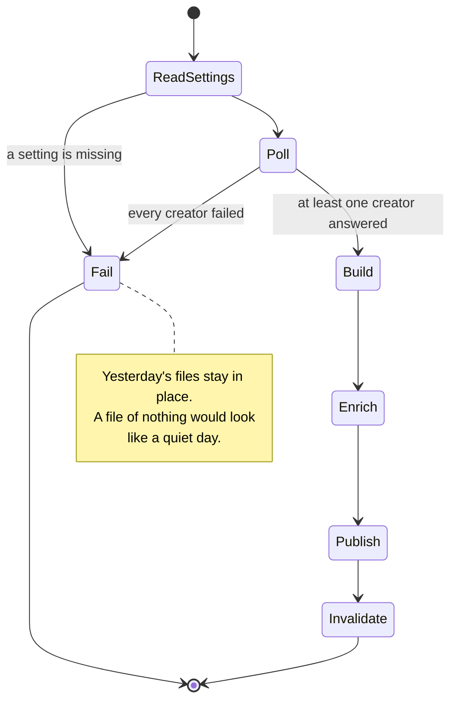
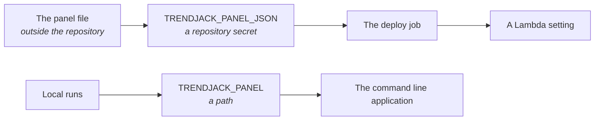
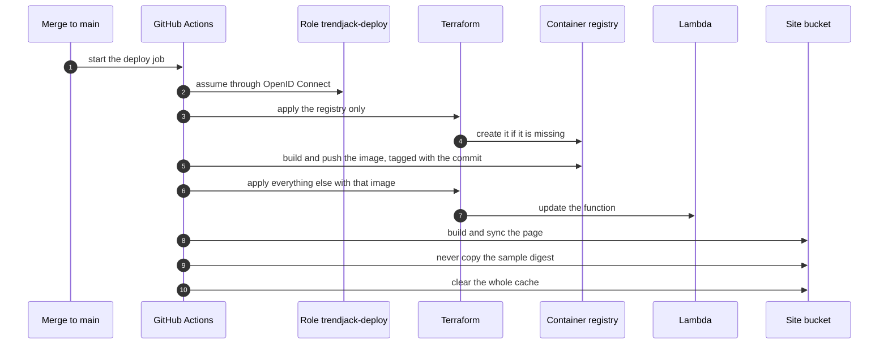
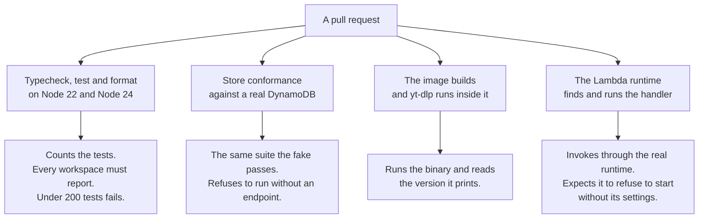
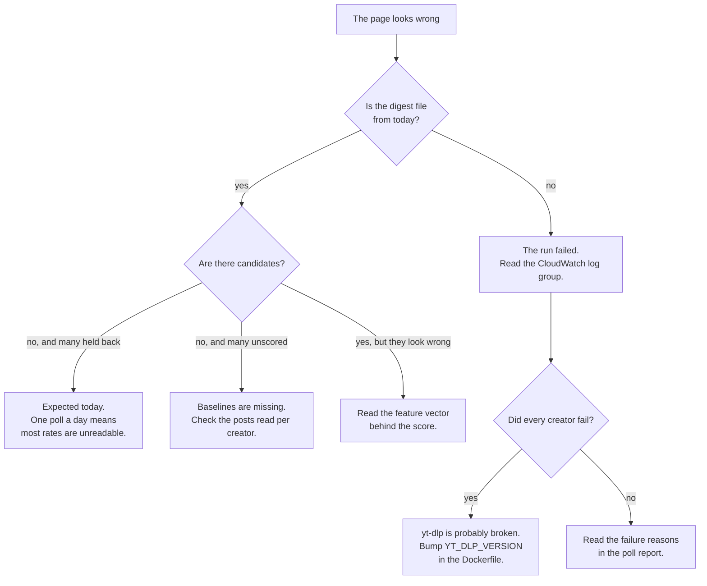

# Operations

## What runs today

Two Lambda functions on one container image.

`trendjack-poller` polls the creator panel once a day, writes four digest files into the site
bucket and clears them from the cache. A static page in the same bucket reads them.

`trendjack-trends` reads how big each watched hashtag is, four times a day. See
[topics.md](topics.md).

One part is not automated: ranking the videos on a hashtag page still runs from a laptop. The
reason is below.

- The page: https://d351g5ghrqojet.cloudfront.net
- The repository: https://github.com/atlantic-blue/trendjack
- Amazon Web Services account 230345688874, region eu-west-1

## Why it is arranged this way

The whole product is one scheduled job and one static file. Nothing needs a server, a database
connection pool, or an authorizer. The cost of running it is close to nothing, and there is very
little that can break at request time.

## How it is achieved

### The daily run



The run reads every setting before it starts. A missing setting stops it at the first step. A run
that polls the panel and then cannot publish would spend the requests and show nothing for them.

### The settings

- `TRENDJACK_BUCKET`. The site bucket. Required.
- `TRENDJACK_TABLE`. The DynamoDB table. Required.
- `TRENDJACK_PANEL_JSON`. The panel, as JSON. Required.
- `TRENDJACK_DISTRIBUTION_ID`. The CloudFront distribution. Optional. Without it the run
  publishes and does not clear the cache.
- `AWS_REGION`. Defaults to eu-west-1.

### The numbers the run uses

- 80 posts read per creator. It must reach past the settled line at 7 days, or no baseline can
  exist. A prolific account posts thirty times in three days, so thirty posts was not enough and
  every video of theirs came back unscored. Eighty covers about a fortnight even for the busiest.
  It costs nothing extra, because the whole list arrives in one request.
- A 2 second pause between creators, so a round does not arrive as one burst.
- 20 videos in each published list.
- A 900 second timeout and 2048 MB of memory.

### The panel

The panel is the list of creators we watch. It is the part of this project that is expensive to
reproduce, so it is deliberately not in this repository.



A test in the repository proves the real panel is not committed. A small invented sample is
committed as a fixture, and nothing else.

To change the panel, edit the repository secret and run the deploy. The next scheduled run picks
it up.

The panel is one flat list of the best creators. It is not grouped by product. Grouping by product
made the pool small and weak, because the product then decided which videos we could ever see. The
match to a product happens later, once we have the video.

### Deploying

Never from a laptop. The deploy job assumes a role through OpenID Connect and applies on merge to
`main`.



The registry is applied first, on its own. The registry must exist before an image can be pushed
to it, and the function needs the image before it can be created.

The sample digest is deleted before the sync. The function writes the real files. Copying the
sample over one of them would put a demo in front of a reader.

### The one thing applied by hand

`infra/bootstrap` is applied once, by an administrator, with their own credentials. It creates the
state bucket and the deploy role.

It has to work this way. The deploy role cannot create itself, because it needs permissions before
it can grant itself any.

Its own state stays local. Nothing depends on it after the first apply, and the two resources can
be imported again if the state is lost.

## The gates

Four checks run on every pull request. Each one is built to fail when it did not really run.



### Why each gate is shaped that way

**The test count is checked, not the exit status.** A runner reports success when it finds no test
files. So the job counts what each workspace reported and fails when a summary is missing or the
total is too low. A suite that ran nothing is indistinguishable from a suite that passed
everything.

**The fake and the real store take one suite.** A double whose behaviour is looser than the real
thing manufactures a false pass.

**A build that succeeded proves the layers ran.** It does not prove the binary works. The wrong
processor architecture downloads happily and then fails at run time. So the job runs yt-dlp and
reads its version.

**An import is not a runtime.** The Lambda runtime resolves a handler by file extension, and it
will not load a TypeScript file. A check that imported the file with Node proved the module parses
and nothing else. The job now invokes the function through the real runtime and fails on "Cannot
find module".

## The traps we have already hit

Written down because each one cost a deploy cycle.

**A TypeScript handler is invisible to the runtime.** There is a two line `index.mjs` that
re exports the real handler. Do not delete it.

**The OpenID Connect subject carries numeric identifiers.** It reads
`repo:atlantic-blue@140661232/trendjack@1331451420:ref:refs/heads/main`. No pattern written
against the plain repository name matches it. CloudTrail held the answer in one query. Two guesses
at the trust policy cost two deploys.

**Naming a GitHub environment breaks the trust.** It changes the subject from
`repo:owner/name:ref:refs/heads/main` to `repo:owner/name:environment:production`, which the role
no longer trusts. The deploy job deliberately names no environment.

**Never delete the worktree that holds the bootstrap state.** The state is local. A removed
worktree took it, and the next apply then tried to recreate a bucket that already existed.

**A green pipeline is not a working product.** Every fault above was found by running the deployed
thing and reading its output. None was found by the tests, which were green throughout.

## When it breaks



yt-dlp breaks whenever TikTok changes. Bump it often. The version is an argument in the Dockerfile,
so a bump is one line in a diff rather than whatever the package index served that day.

An old copy of yt-dlp stops returning anything rather than failing loudly. That is why an empty
answer from a source raises an error.

## Why the videos job is not scheduled

Reading how big a hashtag is works from Amazon Web Services. That number is sent to the browser and
never drawn, so it can be read the moment it arrives.

Reading the videos on a page needs the page to draw itself, and a rendered hashtag page comes back
from that image as a captcha. The same request from a desktop browser at the same moment came back
as thirty cards.

So there is no schedule for it. Invoke it by hand with `{"job":"videos"}`, or run
`trendjack videos <hashtag>` from a machine with a desktop browser.

## What it took to make a browser start in that runtime

Three attempts failed before the browser was asked why. The symptom was `Connection closed` for
every hashtag, which says the pipe went away and nothing else. Turning its own output on gave the
answer:

```
FATAL: sandbox/linux/services/credentials.cc: Check failed: Operation not permitted
ERROR: Did not receive ping from zygote child
Less than 64MB of free space in temporary directory for shared memory files: 0
```

Three things are wrong with that runtime from a browser's point of view. Everything outside `/tmp`
is read only. There is no shared memory. And the process it forks its children from cannot be
created there.

So `HOME` and the cache directories point at `/tmp`, and the browser is started with
`--no-zygote` and `--disable-dev-shm-usage`. Running it as a single process was tried and is worse:
it then closes its own target before a page can be opened, and a test keeps that argument out.

## The gap to fix first

The design calls for three polls a day. The schedule fires once, at 06:00.

Velocity needs two readings that differ by more than the platform's rounding. Acceleration needs
three. With one poll a day, a video first seen this morning has one reading, so its rate is
unreadable and it is held back until tomorrow.

That costs exactly what the product exists for, which is catching a video while it is still
rising. See [heuristic.md](heuristic.md).
