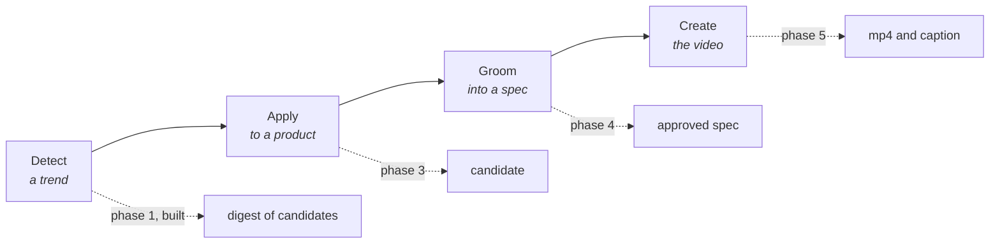
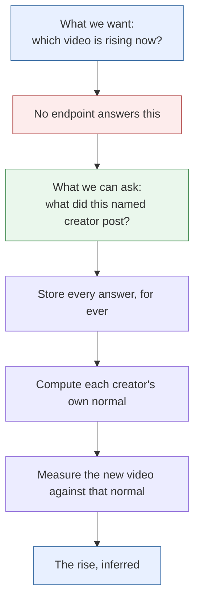
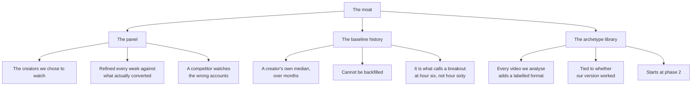
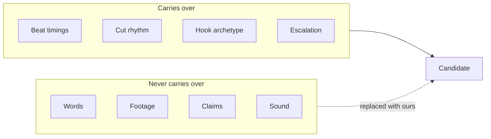
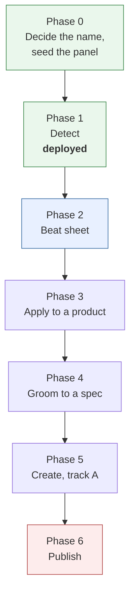

# The product

## What Trendjack is

Trendjack finds a short form video while it is still rising. It works out which of our products
the video fits. It grooms that idea into a ready specification. Then it produces our version of
the video.

The pipeline has four stages. Each stage has its own contract.

Today only stage one runs. The other three stages are designed and not built.

## Why we need it

We sell software products. Short form video is the cheapest way to reach new users. A video that
copies a rising format reaches many more people than a video that copies a dead one.

The value is in the timing. A format that is three days old is already crowded. A format that is
six hours old is still cheap. So the product must find the rise, not the peak.

## How it is achieved

Trendjack watches a fixed list of creators. It records what every post of theirs does, several
times. It then measures each new video against that creator's own normal. The trend is not
fetched. The trend is arithmetic on a history we own.

## Why detection is the hard part

No platform sells the answer. We verified this against primary sources.

- TikTok's Research API requires an applicant to be non commercial. That excludes us.
- Instagram's Graph API has no discovery surface. Hashtag search caps at 30 unique tags in
  7 days.
- TikTok's Creative Center has no public API.
- No vendor sells a "what is trending now" endpoint at any price.

What any tool will answer is narrower. You name a creator. The tool returns that creator's recent
posts with counts attached.

## The moat, and why it holds

Anyone can copy the formula. The formula is public in this repository. Three other things
compound, and a competitor who starts later cannot buy them.

The panel is deliberately not in this repository. It lives in a repository secret. See
[operations.md](operations.md).

## The four constraints that shape the design

These are platform rules. We design around them. We do not work around them.

**Sound never transfers.** A business account on either platform may only use the commercial
music library. Trending sounds are greyed out. TikTok's commercial library terms also forbid use
of those sounds off TikTok. So we copy structure. We never copy audio.

**Originality is judged at account level.** Instagram demotes reposts and near duplicates. The
penalty lands on the account, not on the post. Borders, watermarks, speed changes and a credit to
the creator do not make a video original. Copying a format is normal practice. Re uploading
footage is not.

**Provider risk is our account risk.** Discovery runs against platform terms of service. Today
the poll is read only and signed in as nobody. The moment we authenticate a call with our own
account, we take on that exposure.

**Artificial intelligence disclosure is unverified.** Each platform has its own labelling rule
for generated creative. Check the rules before the first generated video ships.

## The stages we have not built

### Stage 2, apply to a product

A registry holds one entry per product. The entry says what the product does, who it is for,
which proof assets exist, which claims we may not make, and the voice.

The adapter takes a beat sheet and a product, and returns a candidate. One rule makes it a twist
rather than a copy. Keep the structure. Replace the payload.

### Stage 3, groom the video

This is the human gate. Julian approves the specification, not the finished video. That is where
the money is committed, and where taste is worth the most.

A candidate is ready when it has the script, the shot list, the on screen text per beat, the
caption, the sound decision, the aspect, the duration, the call to action, a claims check and a
confidence score. A score under about 80 per cent is flagged, not rendered.

### Stage 4, create the video

Three tracks. Most volume should be track A.

- Track A, screen first. Our products are software. A scripted screen capture beats any
  generative model on accuracy, cost and brand.
- Track B, an artificial actor. Only for a hook that needs a person to camera.
- Track C, generated b roll. Verify the vendor's programmatic access before we commit to it.

### Stage 5, publishing

We hold no accounts yet. Until we do, the pipeline ends at a finished file and a caption in a
review queue. A person posts it by hand. That is the correct first version anyway. Posting by
hand is how we learn what the pipeline gets wrong.

## The phases

Phases 1 to 5 need no social accounts and no platform approval. Only phase 6 does. Phase 6 is the
long pole, because a TikTok content posting audit takes 2 to 6 weeks and Instagram needs an
application review.

## The open question the deployment raised

A panel of very large creators fills the "worked at scale" list easily. It rarely fills the
"worth a look" list. Large accounts are consistent, so they seldom beat their own normal by three
times. Medium sized creators produce many more outliers, but few of them pass the like floor.

The panel probably wants both kinds of creator. That is a decision about curation. It is not a
defect in the code.
