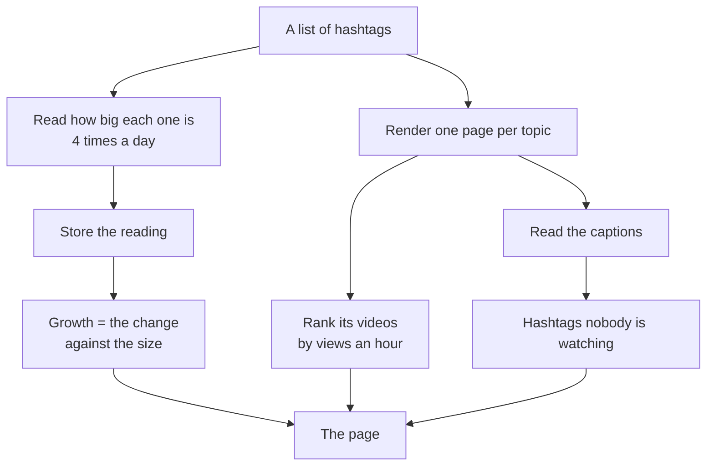
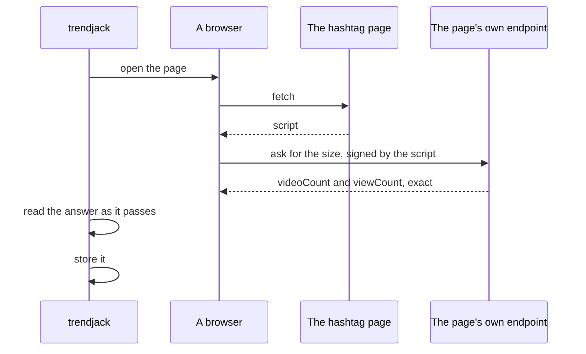
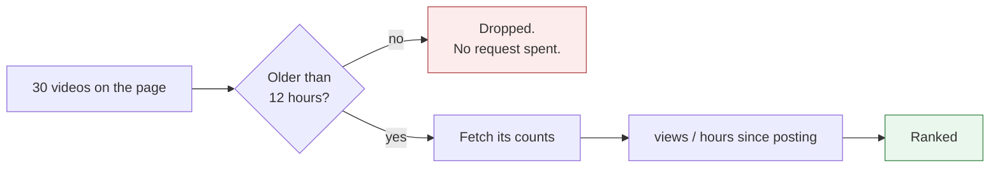
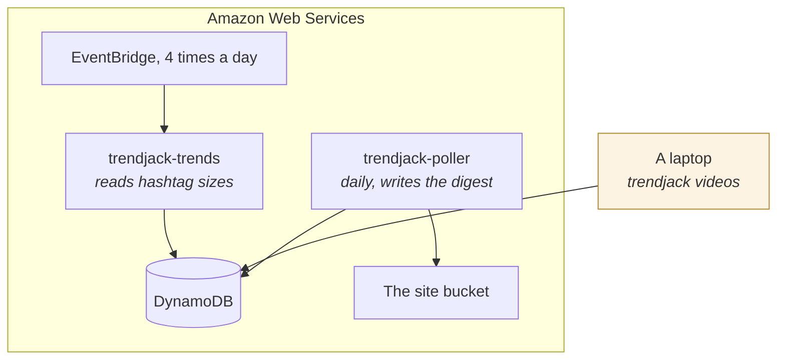

# Topics

## What this is

The second way Trendjack finds something worth copying. It measures a hashtag rather than a video.

The first way, in [heuristic.md](heuristic.md), watches named creators and asks which of their
videos is beating their own normal. This one asks which topic is growing, then which videos on that
topic are doing well.

## Why we need it

The creator panel cannot see a sound or a format spreading. Measured over 30 days across 25
creators, there was not one sound used by two of them inside 24 hours. Zero. And 77 per cent of
their posts used the creator's own sound, because large brand accounts make sounds rather than
adopt them.

A hashtag is different. A platform will say exactly how big a topic is, to anybody who asks.

## How it is achieved



## The size of a hashtag

### What it is

Two numbers: how many videos carry the hashtag, and how many views those videos have.

```
#storytime   videoCount 60,455,583   viewCount 1,238,133,174,079
```

### Why we need it

A trend is a number going up. This is that number, measured directly. It needs no baseline, no
panel and no accumulated history.

### How it is achieved

The number is not in the page source. The page asks its own endpoint for it, and that endpoint
signs every request from script running in the browser. A plain request to the same address answers
with an empty body.

So a browser opens the page, and the answer it receives is read as it arrives.



### What the number is, and is not

It is a net total the platform reports. It falls as well as rises: `#screenrecording` went from
28,131 to 28,130 in half an hour, and `#indiehacker` fell by 3.

So a change of one is not one video being posted. It is the total moving by one, and that can be
forty posted and thirty nine deleted. Nothing in the code says otherwise, and the page says "the
count rose by 1", never "one video was posted".

## Growth

```
change = newest count minus the oldest count inside the window
rate   = change / hours * 24 / the starting count
```

The ends of the window rather than the last pair, because a missed reading would otherwise make a
topic look as though it had stopped. A gap in the readings is a gap in our polling, never a gap in
what people posted.

The ranking is by rate rather than by change. A topic with 97 million videos gains tens of
thousands a day and means nothing by it. A topic with 700 videos gaining 400 is a different event.

### There is no threshold, and that is deliberate

Nothing in the code calls anything a trend.

How much this number moves when nothing is happening has not been measured. Until it has, any cut
would be a number chosen by feel, and a threshold picked that way is worth nothing. The page shows
the change that was read, and the rate second, marked as a projection.

## The videos on a topic

### What it is

The videos a hashtag page is showing, ranked by views an hour since posting.

### Why views an hour

A hashtag page carries videos years old beside videos from this morning. Ranked by views alone the
archive wins every time.

Measured on one page of `#buildinpublic`:

```
195,800 views, posted 426 days ago      19 an hour
 49,100 views, posted 24 hours ago   2,021 an hour
```

The first is the top video by views and is nearly dead. The second is the one worth copying.

### The twelve hour floor

A video forty minutes old shows a huge rate from a handful of views.

So nothing under twelve hours old is ranked. That costs being half a day late to a video, and buys
a rate measured over a window long enough to mean something.

The age comes from the video identifier, whose top 32 bits are the second it was minted. Checked
against three videos whose pages report a creation time, the identifier ran 13 to 24 seconds early.
So the floor is applied before any request is made, and nothing under it is ever fetched.



### Two very different costs

Listing a page is one request. Reading counts is one request per video. So everything that cannot
be ranked is dropped first.

## Finding new topics

### What it is

The hashtags people wrote in the captions of the pages we already read, minus the ones we watch.

### Why we need it

A fixed list of twenty topics expires. Some are already archives: `#saas` had 1 of 30 videos posted
in the last 72 hours, and its oldest was 1,384 days. `#buildinpublic` had 15 of 30 inside 72 hours.

There is no other free source. Search needs an account, and the trending pages refuse us.

### How it is achieved

Every page render returns thirty captions, and people label their own work. The captions were
already being downloaded, so this costs no request at all.

A hashtag that turns up under several watched topics ranks above a busy one under a single topic,
because the second is usually that topic's own vocabulary written a different way.

```
#entrepreneurship   under founder, buildinpublic   in 3 videos
#business           under founder, saas            in 3 videos
#founderstory       under founder                  in 2 videos
```

Nothing is filtered. `#fyp` and `#foryou` come through and they are noise, but no rule for dropping
them has been measured, so none is written.

## Where each part runs



The sizes run in Amazon Web Services. The videos do not, and that is the one part still tied to a
person's machine. See [operations.md](operations.md).
